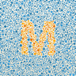
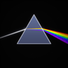
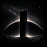

# Hi, I'm Luminoid 👋

I build iOS apps for iPhone, iPad, and Mac, and the open-source Swift frameworks behind them.

🌐 [luminoid.dev](https://luminoid.dev) · ✍️ [blog.luminoid.dev](https://blog.luminoid.dev)

## 📱 Apps

| | App | Description | Links |
|:-:|-----|-------------|-------|
|  | **Plantfolio** | Plant care with AI identification (7,800+ species), seasonal watering schedules, sighting maps, iCloud sync, and widgets | [App Store](https://apps.apple.com/us/app/plantfolio-plus/id6757148663) · [Website](https://plantfolio.luminoid.dev) · [Plant data](https://github.com/Luminoid/plantfolio-common-plants) |
|  | **Petfolio** | Pet care across 10 species and 573 breeds: health logs, vet visits, medication schedules, Live Photo galleries, and Family Sharing | [App Store](https://apps.apple.com/us/app/petfolio-pet-care/id6764127493) · [Website](https://petfolio.luminoid.dev) |
|  | **TripDays** | Collaborative travel planner: day-by-day itineraries, paste-to-fill travel links, shared trips over iCloud, maps, and any-currency expense splitting | [App Store](https://apps.apple.com/us/app/tripdays-trip-planner/id6794614173) · [Website](https://tripdays.luminoid.dev) |
|  | **Metamer** | Color-vision camera: live CVD simulation, daltonize filters, true-color naming, and an Ishihara plate generator, entirely on-device | [App Store](https://apps.apple.com/us/app/metamer/id6779320695) · [Website](https://metamer.luminoid.dev) |

## 🧩 Frameworks

| | Package | Description | Links |
|:-:|---------|-------------|-------|
|  | **LumiKit** | Design tokens, themeable UI components, and utilities for UIKit apps. Swift 6.2 strict concurrency, 1,000+ tests | [GitHub](https://github.com/Luminoid/LumiKit) · [Swift Package Index](https://swiftpackageindex.com/Luminoid/LumiKit) · [Docs](https://swiftpackageindex.com/Luminoid/LumiKit/documentation/lumikitui) |
|  | **Prism** | Camera pipeline for iOS 18+: actor-isolated AVCaptureSession with async/await capture, full manual controls, and a Metal-backed Core Image filter chain | [GitHub](https://github.com/Luminoid/Prism) · [Swift Package Index](https://swiftpackageindex.com/Luminoid/Prism) |
|  | **Sophon** | AI infrastructure: Gemini client with configurable retry policies, schema-constrained structured output, lenient LLM JSON decoding, and a model catalog that falls back automatically when a model is retired | [GitHub](https://github.com/Luminoid/Sophon) |

## 🛠️ Tools

| | Tool | Description | Links |
|:-:|------|-------------|-------|
|  | **Monolith** | CLI that scaffolds iOS apps, Swift Packages, and Swift CLIs from production-grade templates, with 25 optional app features and App Store-ready configuration | [GitHub](https://github.com/Luminoid/Monolith) |

## 🌐 Web projects

- 📷 [**LensDB**](https://lens.luminoid.dev): comparison chart for 721 mirrorless lenses across 20 brands ([source](https://github.com/Luminoid/lens-db))
- 📜 [**Echoes**](https://echoes.luminoid.dev): 2,300+ curated quotes in English and Chinese ([source](https://github.com/Luminoid/echoes))
- 🔭 [**Spectral Lab**](https://lab.luminoid.dev): interactive optics and astrophysics visualizations ([source](https://github.com/Luminoid/spectral-lab))

---

`Swift 6.2` · `UIKit` · `SwiftData / Core Data + CloudKit` · `Metal` · `AVFoundation` · `SvelteKit` · `Astro`
